<h1>Проект - список задач</h1>

<p>Проект представляет собой сервис по созданию задач.
Задачи можно изменять, менять статус (выполнено)</p>

<h3>Использованные технологии</h3>
<ol>
<li>Spring Framework 2.7.3</li>
<li>PostgreSQL 42.2.9</li>
<li>Liquibase 4.15.0</li>
<li>Hibernate 5.6.11.Final</li>
<li>Collections Framework</li>
<li>HTML, CSS</li>
<li>Bootstrap </li>
</ol>
<h3>Требования к окружению</h3>
<ol>
<li>Java 17</li>
<li>PostgreSQL 15</li>
<li>Apache maven 3.8</li>
</ol>
<h3>Запуск проекта</h3>
<ol>
<li>Установить JDK 17</li>
<li>Установить Maven</li>
<li>Установить сервер БД PostgresSQL, при установке задать имя пользователя - postgres, пароль postgres, порт - 5432</li>
<li>Скачать исходный код проекта с GitHub</li>
<li>Открыть postgresSQL при помощи команды в терминале ```sudo
-u postgres psql
```</li>
<li>Создать и подключится к БД todo
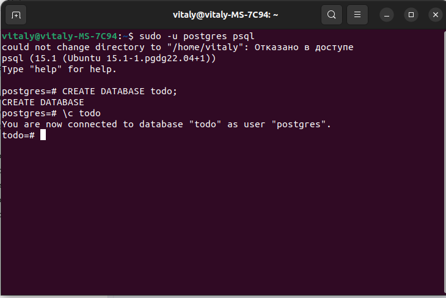</li>
<li>С помощью команды ```
CREATE TABLE IF NOT EXISTS tasks (
   id SERIAL PRIMARY KEY,
   description TEXT,
   created TIMESTAMP,
   done BOOLEAN
);
create table IF NOT EXISTS users
(
    id        serial primary key,
    name varchar        not null,
    login     varchar unique not null,
    password  varchar        not null
);
```
создать таблицу задач и пользователей
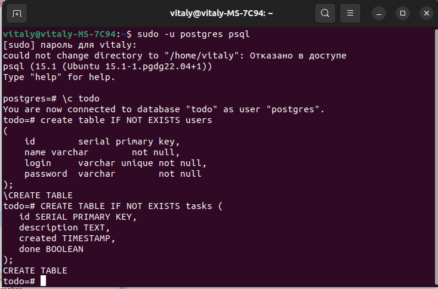
</li>
<li>При помощи терминала перейдите в папку с исходным кодом, и выполните команду 
```
mvn spring-boot:run
```
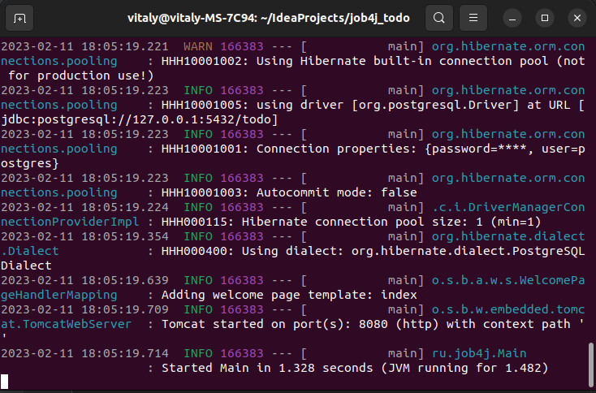</li>
<li>Откройте браузер с URL:"http://localhost:8080/"</li>
</ol>
<h3>Взаимодействие с приложением</h3>
<p>Проект представляет собой список задач, которые нужно выполнить:</p>
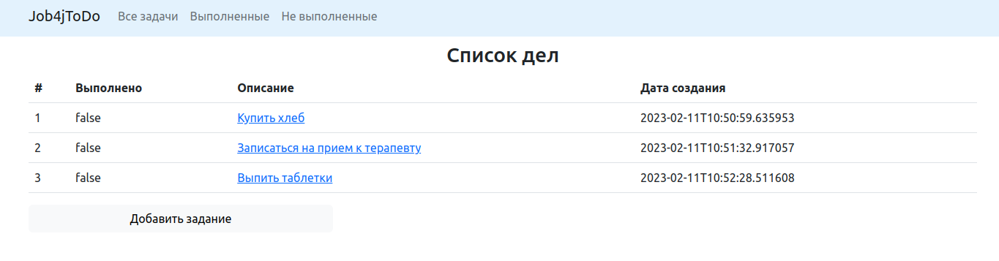 
<p>При переходе по ссылке определенного задания, вы попадаете на более подробную страницу, в которой можно удалить, редактировать или выполнить задачу</p>
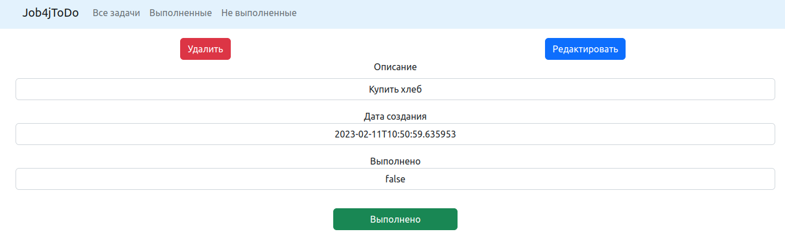 
<p>При переходе на страницу редактирования задачи вы можете изменить ее описание:</p>
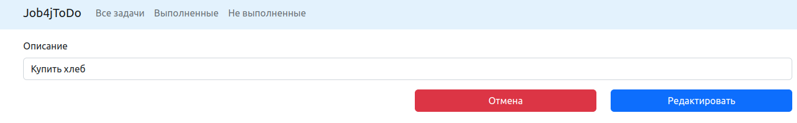 
<p>Нажав кнопку выполнено вы переключаете состояние задачи на значение true</p>
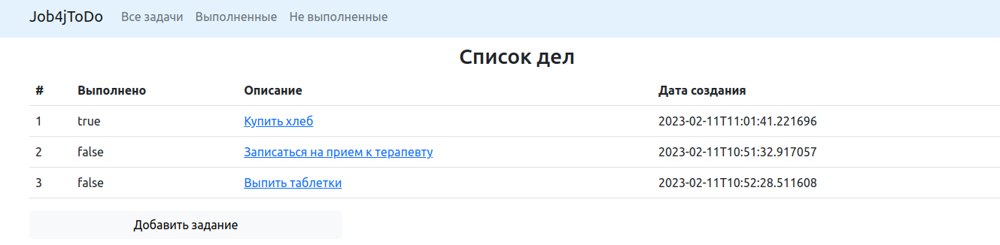 
<p>На основной странице можно добавить новую задачу:</p>
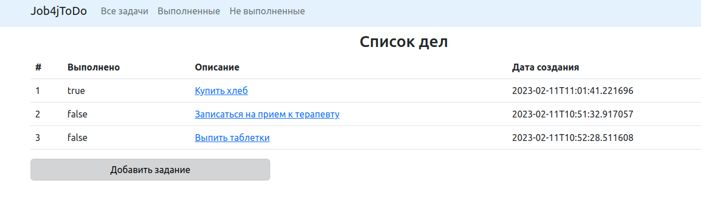
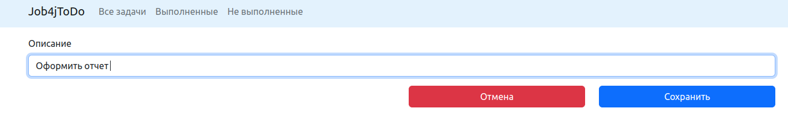
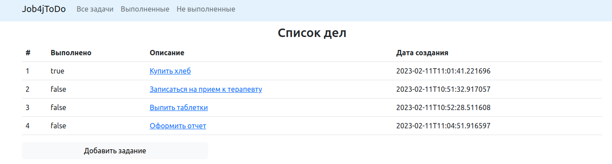
<p>Также на шапке страницы имеются фильтры отображения задач:</p>
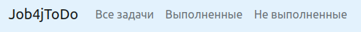
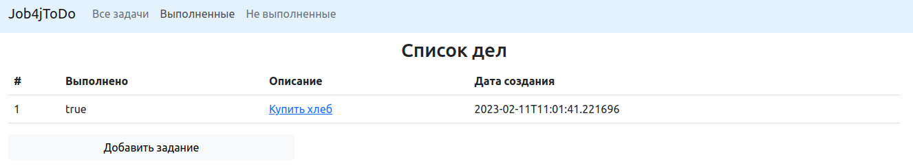
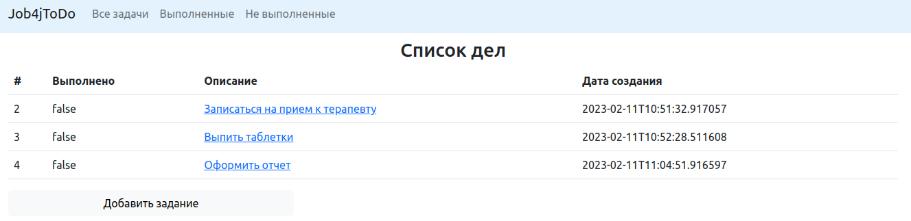
<p>Список дел доступен только зарегистрированным пользователям:</p>
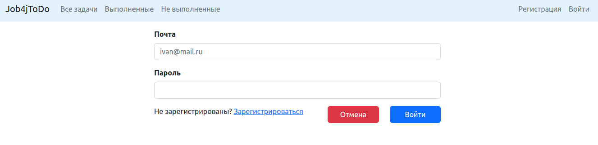
<p>Чтобы зарегистрироваться необходимо перейти по ссылке:</p>
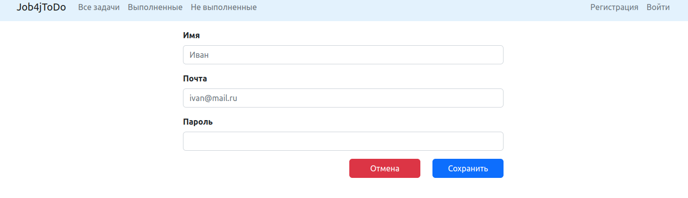
<p>После входа будет доступен весь функционал приложения:</p>
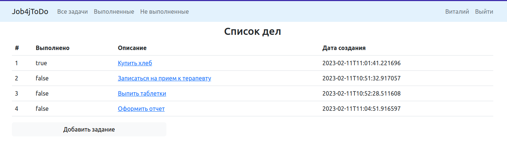
Почта: vithag97@mail.ru<br>

